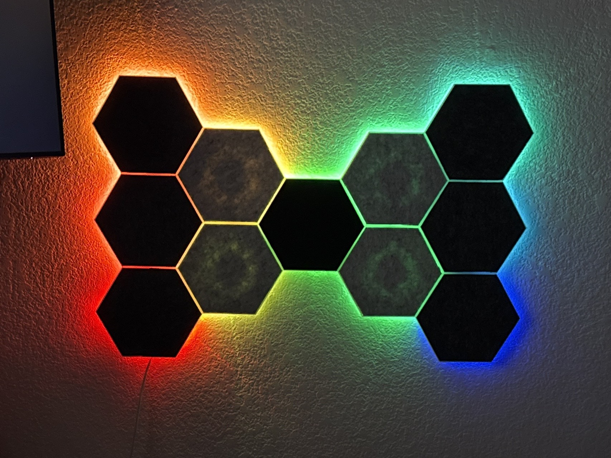

# Custom Hex Acoustic Panel Frame with Color LEDs

Custom acoustic panels that can be lit up from within using color LED strips.

## Mechanical

3D print one stencil and as many frames as you'd like. Cut an acoustic panel using the stencil. Glue/tape it to the frame. Wrap LED strip around circle on bottom of frame. Route wires through available holes. Profit.

I used [these acoustic panels](https://www.amazon.com/dp/B0BBMH56HP), but you can use almost anything you like (so long as you can cut them into shape).

> **Note:** You can use the *hex-acoustic-panel-frame-clamp.stl* clamps to help secure wires by screwing them into the panels' mount holes (M3 screws).

## Firmware

The firmware is Arduino code custom designed for the ESP32 (tested with ESP32-WROOM-32E on a [PixelBlaze v3.6 board](https://electromage.com/pixelblaze)). Follow the instructions in *firmware/color_control_server/color_control_server.ino* for information on how to upload the HTML to the ESP32 and then flash the firmware using the Arduino IDE.

## License

The panel STL files are licensed under [CC BY 4.0](https://creativecommons.org/licenses/by/4.0/deed.en).

The Arduino firmware is licensed under [Zero-Clause BSD](https://opensource.org/license/0bsd) (unless otherwise noted).